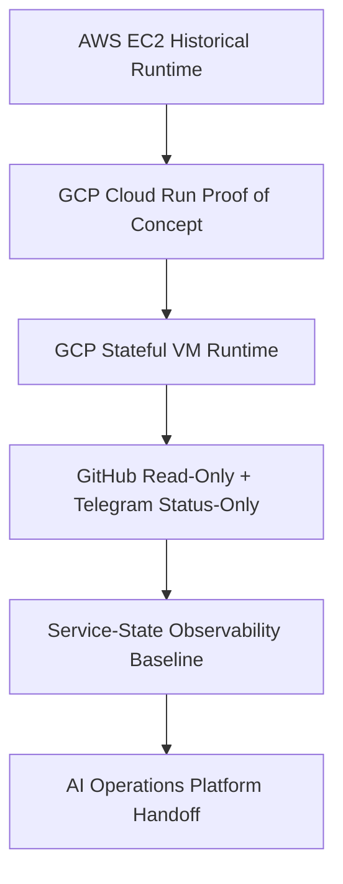
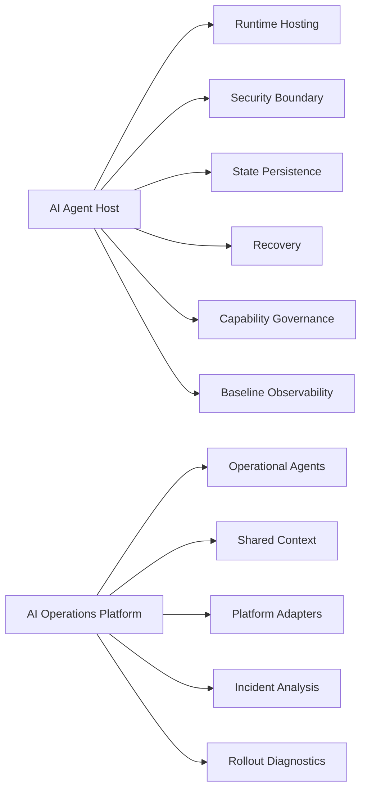

# Architecture

## Purpose

This document summarizes the current AI Agent Host architecture.
AI Agent Host is a self-owned runtime foundation for hosting AI agent runtimes
inside an operator-controlled cloud boundary. It is not the full AI Operations
Platform.

The repository now records validated hosting, security, state, recovery,
capability governance, baseline observability, and handoff patterns for the
future platform.

## Project Boundary

AI Agent Host answers:

```text
Where and how does a self-hosted AI agent runtime run safely?
```

AI Operations Platform answers:

```text
How do operational agents analyze, diagnose, and assist cloud operations workflows?
```

AI Agent Host owns runtime foundation concerns:

- runtime hosting patterns;
- private access and secret boundaries;
- state persistence and recovery;
- Terraform-managed deployment patterns;
- capability governance;
- baseline observability;
- transition and handoff documentation.

AI Operations Platform owns operational workflow concerns:

- operational agents;
- shared context and context lifecycle;
- platform adapters;
- incident analysis;
- rollout diagnostics;
- human-approved remediation workflows;
- multi-agent operations orchestration.

## Architecture Evolution



The architecture moved from early AWS VM hosting to a GCP Cloud Run
proof-of-concept and then to a GCP Stateful VM runtime for the state-owning
OpenClaw gateway.

## Runtime Paths

| Runtime path | Current role | Boundary |
| --- | --- | --- |
| AWS EC2 | Historical baseline and optional comparison target. | Not active closeout scope. |
| GCP Cloud Run | Validated proof-of-concept and container contract reference. | Not the durable state-owning runtime today. |
| GCP Stateful VM | Current mature runtime path. | Private, single-writer, persistent state runtime. |

## Current Mature Runtime: GCP Stateful VM

The current mature path runs OpenClaw on a private GCP Stateful VM behind IAP.
It keeps exactly one active writer for the authoritative OpenClaw state disk.

Core characteristics:

- private Compute Engine VM in a zonal Stateful MIG;
- MIG target size `1`;
- no public VM IP;
- no public OpenClaw endpoint;
- IAP SSH and IAP TCP forwarding for operator access;
- preserved Persistent Disk mounted at `/var/lib/openclaw`;
- systemd-managed OpenClaw container;
- digest-pinned Artifact Registry image;
- Secret Manager-backed runtime values;
- daily snapshot policy;
- isolated snapshot restore drill;
- GitHub read-only mode;
- Telegram status-only operator channel;
- service-state observability baseline.

The current Stateful VM Terraform root is
`gcp/openclaw_stateful_vm/terraform/`.

## Cloud Run Role and Boundary

The Cloud Run path validated the container contract, Secret Manager
integration, Gemini path, Cloud Logging integration, Control UI onboarding, and
GitHub control behavior. It remains useful as a runtime reference.

Cloud Run is not treated as the durable state-owning OpenClaw runtime today
because OpenClaw state requires a practical single-writer persistent state
boundary.

The public Cloud Run runtime material lives under `gcp/openclaw_cloud_run/`.
Earlier generic Cloud Run bootstrap material is archived outside the public
tracked layout.

## AWS Role and Boundary

The AWS material remains useful as an EC2-based historical baseline and a
future multi-cloud comparison target. AWS parity is optional and deferred unless
the future AI Operations Platform needs a cloud-provider comparison.

## Capability Governance

The architecture follows the governance rule:

```text
Agent may request new capabilities.
Agent may not grant itself new capabilities.
```

Capability expansion requires tracked configuration changes, operator approval,
validation, and rollback planning. This applies to GitHub PR/write mode, shell
execution, Terraform execution, MCP, Telegram command expansion, DevBox
execution, and OpenClaw self-upgrade paths.

## Observability Baseline

The current observability baseline stops at service-state signals:

- service-state exporter deployed;
- recurring Cloud Monitoring writes enabled for approved service-state metric
  types;
- approved metric types: `active`, `available`, `healthy`, and `running`;
- service-state alert policy skeleton added and disabled by default.

Full alert routing, notification channels, incident workflows, and
AI-assisted operational investigation are transferred to AI Operations
Platform.

## Transition to AI Operations Platform



AI Agent Host provides the runtime foundation. AI Operations Platform builds
the operational agent, workflow, adapter, and shared-context layer around that
foundation.

## Documentation Map

- [Project README](../README.md)
- [Project Transition to AI Operations Platform](project-transition-to-ai-operations-platform.md)
- [Security Model](security-model.md)
- [Deployment Model](deployment-model.md)
- [GCP Cloud Run Runtime](../gcp/openclaw_cloud_run/README.md)
- [GCP Stateful VM Runtime](../gcp/openclaw_stateful_vm/README.md)
