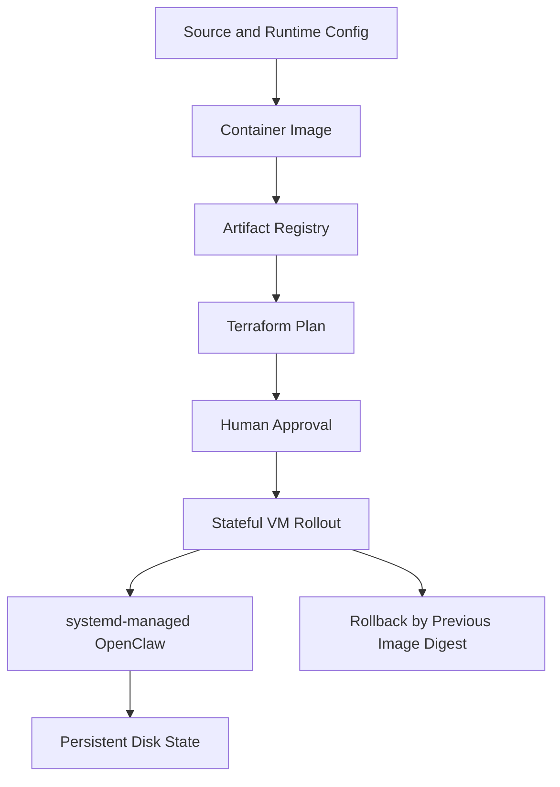

# Deployment Model

## Purpose

This document summarizes the top-level deployment model for AI Agent Host at
closeout. The project has three runtime paths: AWS EC2 as a historical
baseline, GCP Cloud Run as a validated proof-of-concept, and GCP Stateful VM as
the current mature state-owning runtime path.

## Runtime Deployment Paths

| Runtime path | Role | Current posture |
| --- | --- | --- |
| AWS EC2 | Historical VM-hosted runtime baseline. | Optional comparison target. |
| GCP Cloud Run | Proof-of-concept and container contract validation. | Not the durable state-owning runtime today. |
| GCP Stateful VM | Current mature runtime. | Private, persistent, single-writer runtime. |

## AWS EC2 Historical Runtime

The AWS path established an early VM-hosted runtime pattern:

- Terraform-managed infrastructure;
- EC2-based OpenClaw hosting;
- IAM-based access to model services;
- operational hardening lessons.

Further AWS parity is optional and deferred unless the future AI Operations
Platform needs multi-cloud runtime comparison.

## GCP Cloud Run Proof-of-Concept Runtime

The Cloud Run path validated important runtime and deployment contracts:

- container build and startup behavior;
- Artifact Registry publishing;
- Secret Manager integration;
- Gemini path;
- Cloud Logging integration;
- Control UI onboarding;
- GitHub control behavior.

Cloud Run remains a useful proof-of-concept and runtime contract reference. It
is not treated as the durable state-owning OpenClaw runtime today because the
current OpenClaw gateway needs a practical persistent single-writer state
boundary.

The public Cloud Run proof-of-concept runtime lives under
`gcp/openclaw_cloud_run/`. Earlier generic Cloud Run bootstrap material is not
kept as a public runtime path.

## GCP Stateful VM Current Mature Runtime

The Stateful VM path is the current mature deployment model:

- private Compute Engine VM through a zonal Stateful MIG;
- target size `1`;
- no public VM IP;
- no public OpenClaw endpoint;
- IAP access model;
- systemd-managed OpenClaw container;
- digest-pinned Artifact Registry image;
- Persistent Disk mounted at `/var/lib/openclaw`;
- daily snapshot policy;
- manual rollback by previous image digest;
- service-state observability baseline.

Its current Terraform root is `gcp/openclaw_stateful_vm/terraform/`.

## Terraform-Managed Rollout Model

Infrastructure changes are managed through Terraform and require operator
review. Terraform is not an agent self-service mutation path.

## Artifact Registry and Digest-Pinned Images

The GCP runtime uses Artifact Registry as the image source. Runtime rollouts
should use immutable image digests rather than mutable tags for reviewed
deployment decisions.

Digest-pinned rollouts support clear rollback and reduce ambiguity during
incident response.

## systemd-Managed OpenClaw Container

On the Stateful VM, systemd owns OpenClaw startup, restart, and shutdown
behavior. The service prepares runtime secrets, pulls the pinned image, mounts
only the required state/workspace/runtime paths, and logs through the VM
operating environment.

Docker does not replace the systemd operational boundary.

## Persistent Disk State Model

The authoritative OpenClaw state lives on a preserved Persistent Disk mounted
at `/var/lib/openclaw`. The Stateful MIG target size remains `1`, and the disk
is protected against accidental destruction.

The design prioritizes one active writer for the OpenClaw state boundary.

## Manual Rollback Model

Rollback is explicit and operator-controlled:

- image rollback uses the previous approved digest;
- state rollback requires selecting a snapshot and accepting data loss after
  that snapshot;
- destructive recovery actions require separate approval;
- public docs do not store raw Terraform plans or secret material.

## Closeout Deployment Posture

AI Agent Host is moving into closeout as a runtime foundation. Active
deployment work should remain limited to maintenance, documentation closeout,
optional runtime research, and approved runtime safety fixes.

Advanced operational workflows, rollout diagnostics, GitHub remediation, shared
context, and multi-agent orchestration are transferred to AI Operations
Platform.

## Related Documents

- [Project README](../README.md)
- [Architecture](architecture.md)
- [Security Model](security-model.md)
- [Project Transition to AI Operations Platform](project-transition-to-ai-operations-platform.md)
- [GCP Cloud Run Runtime](../gcp/openclaw_cloud_run/README.md)
- [GCP Stateful VM Runtime](../gcp/openclaw_stateful_vm/README.md)
