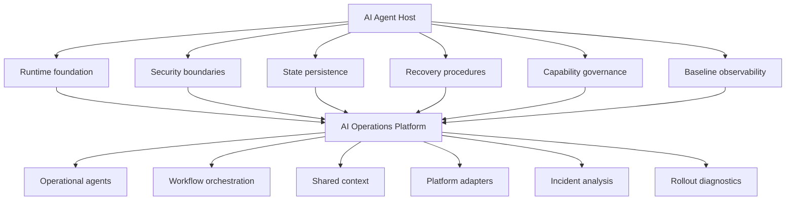

# Project Transition to AI Operations Platform

## Purpose

This document defines the transition boundary between AI Agent Host and the
future AI Operations Platform.

AI Agent Host is the infrastructure foundation project. It validates where and
how a self-hosted AI agent runtime can run safely.

AI Operations Platform is the next project. It will build the operational
intelligence layer that uses agents, workflows, adapters, and shared context to
assist cloud operations.

---

## Boundary Statement

```text
AI Agent Host answers:
Where and how does a self-hosted AI agent runtime run safely?

AI Operations Platform answers:
How do AI agents analyze, diagnose, and assist cloud operations workflows?
```

AI Agent Host should not grow into the AI Operations Platform. The host project
should close out as a stable foundation and transfer operational agent work to
the platform project.

---

## Validated Foundation from AI Agent Host

### Runtime Hosting

AI Agent Host validated multiple runtime paths:

* AWS EC2 runtime as an early historical baseline;
* GCP Cloud Run proof-of-concept runtime;
* GCP Stateful VM runtime as the practical state-owning runtime path.

The Cloud Run path remains useful as a container contract and serverless
deployment reference. The Stateful VM path is the mature runtime foundation for
stateful OpenClaw operation.

### Stateful Runtime Model

The GCP Stateful VM runtime validated:

* private Compute Engine VM through a zonal Stateful MIG;
* target size `1`;
* no public VM IP;
* no public OpenClaw endpoint;
* IAP TCP forwarding and OS Login access;
* preserved Persistent Disk mounted at `/var/lib/openclaw`;
* single-writer state model;
* systemd-managed OpenClaw container;
* digest-pinned image rollout;
* Secret Manager runtime retrieval;
* Cloud NAT private outbound access;
* TCP health check baseline;
* daily snapshot policy;
* service restart persistence;
* Stateful MIG recreate persistence;
* isolated snapshot restore drill;
* manual rollback path.

### Security and Access Model

The host project established a conservative security posture:

* private-by-default runtime;
* no public AI dashboard;
* least-privilege service identity;
* cloud-native secret storage;
* no committed secrets;
* IAP-based operator access;
* explicit approval before destructive or deploy-time actions;
* read-only defaults where practical.

### Capability Governance

AI Agent Host defined a key governance rule:

```text
Agent may request new capabilities.
Agent may not grant itself new capabilities.
```

This model applies to:

* GitHub PR/write mode;
* shell execution;
* Terraform execution;
* MCP enablement;
* tool and skill expansion;
* Telegram command expansion;
* DevBox execution;
* OpenClaw self-upgrade.

New capabilities require tracked configuration changes, operator approval,
validation, and rollback.

### Telegram Status-Only Operator Channel

The Telegram adapter is complete for status-only runtime scope.

Approved commands:

* `/status`
* `/health`
* `/whoami`
* `/help`

Out of scope without separate approval:

* `/ask`;
* GitHub commands;
* PR/write mode;
* Terraform commands;
* shell execution;
* browser automation;
* MCP;
* DevBox execution;
* OpenClaw self-upgrade.

Telegram should remain a status-only host-level channel in AI Agent Host.
Interactive operator workflows belong to AI Operations Platform.

### Observability Baseline

AI Agent Host established a service-state observability baseline:

* service-state exporter deployed;
* recurring Cloud Monitoring writes enabled for the approved service-state
  metric types:

  * `active`;
  * `available`;
  * `healthy`;
  * `running`;
* service-state alert policy skeleton added and disabled by default.

Full alert routing, notification workflows, incident triage, and multi-source
observability analysis are transferred to AI Operations Platform.

---

## What Transfers to AI Operations Platform

The following areas should be developed in AI Operations Platform rather than
expanded inside AI Agent Host.

### Operational Agents

Examples:

* observability analysis agent;
* incident triage agent;
* diagnosis agent;
* rollout diagnostics agent;
* remediation planning agent;
* repository execution agent;
* operator liaison agent;
* FinOps analysis agent.

### Workflow Orchestration

Examples:

* alert intake workflow;
* incident investigation workflow;
* rollout diagnostics workflow;
* human approval workflow;
* PR-only remediation workflow;
* post-incident summary workflow;
* backup/restore drill workflow.

### Shared Context and Context Lifecycle

Examples:

* external incident state store;
* rollout state;
* decision log;
* structured handoff artifacts;
* context budget monitoring;
* automatic session rollover;
* read-only continuation after rollover;
* fresh approval before mutation after rollover;
* multi-agent context partitioning.

### Platform Adapters

Examples:

* Cloud Logging adapter;
* Cloud Monitoring adapter;
* GKE API adapter;
* Prometheus adapter;
* GitHub API adapter;
* Argo Rollouts adapter;
* Cloud Deploy adapter;
* Binary Authorization adapter;
* FinOps resource scanner adapter.

### Interactive Operator Workflows

Examples:

* Telegram incident status;
* Telegram approval request display;
* operator summary notifications;
* incident handoff summaries;
* mobile review workflows.

These must not be confused with the existing status-only Telegram adapter in AI
Agent Host.

---

## What Stays in AI Agent Host

AI Agent Host should retain:

* runtime hosting code and documentation;
* Cloud Run proof-of-concept material;
* Stateful VM runtime material;
* security model and access pattern documentation;
* Secret Manager and private access patterns;
* state persistence and recovery runbooks;
* service-state observability baseline;
* Telegram status-only runtime documentation;
* capability governance documentation;
* optional runtime research notes;
* transition documentation.

AI Agent Host should not add new operational agent features after closeout.

---

## Architecture Transition



---

## Recommended Starting Point for AI Operations Platform

The AI Operations Platform should start with a minimal platform planning
sequence rather than continuing host-level work in this repository.

Recommended initial workstreams:

```text
0. Foundation Import
1. Platform Architecture Baseline
2. Shared Context and Context Lifecycle
3. Observability Adapter MVP
4. Incident Triage MVP
5. Rollout Diagnostics MVP
6. Human-Approved Remediation Workflow
7. Multi-Agent Operations Orchestration
8. Platform Hardening
9. Integrated Portfolio Demo
```

---

## Closeout Criteria for AI Agent Host

AI Agent Host can be considered ready for closeout when:

* root README clearly states the project boundary;
* top-level public documentation states the closeout and handoff boundary;
* this transition document exists and is linked from the README;
* service-state observability baseline is documented;
* alert routing and advanced operations are deferred to AI Operations Platform;
* GitHub PR/write remains disabled unless separately approved;
* Telegram remains status-only;
* context lifecycle implementation is transferred to AI Operations Platform;
* multi-agent orchestration is transferred to AI Operations Platform;
* no new host-level runtime mutation is required for the transition.

---

## Deferred and Optional Work

The following items may be revisited later, but they are not required for AI
Agent Host closeout:

* deeper Cloud Run durable-state hosting research;
* AWS-native runtime parity;
* multi-cloud runtime comparison;
* always-on versus start-stop runtime optimization;
* Vertex AI identity-based model access migration;
* runtime maintenance and security hardening updates.

These items should not block the transition to AI Operations Platform.

---

## Safety Rules During Transition

Do not use the transition as a reason to expand runtime capabilities inside AI
Agent Host.

Specifically, do not enable by default:

* GitHub PR/write mode;
* Telegram `/ask`;
* Terraform execution through Telegram or agent tools;
* shell execution through Telegram;
* browser automation;
* MCP servers;
* DevBox execution;
* OpenClaw self-upgrade;
* alert notification routing;
* autonomous remediation.

Future capability expansion must happen through explicit tracked changes,
operator approval, validation, and rollback planning.

---

## Summary

AI Agent Host provides the self-owned runtime foundation.

AI Operations Platform should build on that foundation to deliver operational
agents, shared context, workflow orchestration, platform adapters, incident
analysis, rollout diagnostics, and human-approved cloud operations assistance.

```text
Host the agent safely first.
Then build the operations platform around it.
```
