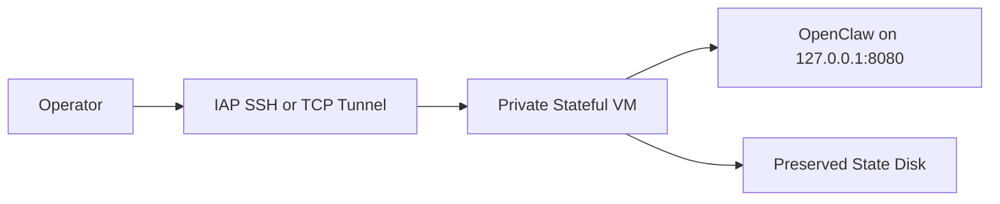

# Security Model

## Purpose

This document summarizes the top-level security and governance model for AI
Agent Host at closeout. It describes the validated posture for the current GCP
Stateful VM runtime and the safety boundaries that carry forward into the
future AI Operations Platform.

## Security Principles

AI Agent Host uses conservative platform engineering defaults:

- no public AI dashboard by default;
- private runtime access paths;
- least-privilege service identities;
- cloud-native secret management;
- explicit approval before destructive or deploy-time actions;
- read-only operational defaults where practical;
- capability governance before agent tool expansion;
- no secrets in public documentation.

The project does not claim full production security certification or broad
enterprise readiness. It records practical security boundaries for a
self-hosted runtime foundation.

## Current GCP Stateful VM Security Posture

The current mature runtime is a private GCP Stateful VM deployment:

- no public VM IP;
- no public OpenClaw endpoint;
- IAP SSH and IAP TCP forwarding for operator access;
- OS Login-based operator access;
- dedicated runtime service account;
- Artifact Registry read access scoped to the runtime image repository;
- Secret Manager access scoped to named runtime secrets;
- logging and monitoring writer permissions only where needed;
- preserved state disk protected from accidental Terraform destruction;
- digest-pinned container image rollout.

## Access Boundary

Operator access is private by default. The Stateful VM exposes no public
dashboard or public OpenClaw endpoint. Operators use IAP and local tunnels for
interactive access.



Public ingress, external load balancers, and public webhook paths are not part
of the current runtime posture.

## Secret Boundary

Sensitive runtime values are stored outside Git and public docs.

Current boundary:

- Secret Manager stores sensitive runtime values;
- Terraform references named secrets, not payload values;
- VM startup retrieves approved secret values at runtime;
- secret files are written only to restricted runtime paths;
- public docs may include variable names and placeholders, not secret values.

Do not commit token values, Secret Manager payloads, webhook URLs,
notification channel identifiers, or real Telegram chat identifiers.

## Agent Capability Boundary

Capability governance rule:

```text
Agent may request new capabilities.
Agent may not grant itself new capabilities.
```

Any expansion of tools, skills, MCP servers, GitHub mode, shell execution,
Terraform execution, Telegram commands, browser automation, DevBox execution,
or OpenClaw self-upgrade requires a tracked change, operator approval,
validation, and rollback plan.

## GitHub Boundary

GitHub read-only mode is validated for the Stateful VM runtime.

Current boundary:

- GitHub mode is read-only;
- PR/write mode is disabled unless separately approved;
- MCP servers remain empty;
- write-capable GitHub remediation workflows are transferred to AI Operations
  Platform.

AI Agent Host does not treat GitHub PR/write remediation as a closeout feature.

## Telegram Boundary

Telegram is status-only in AI Agent Host.

Approved commands:

- `/status`
- `/health`
- `/whoami`
- `/help`

Out of scope without separate approval:

- `/ask`;
- GitHub commands;
- PR/write;
- Terraform commands;
- shell execution;
- browser automation;
- MCP;
- DevBox execution;
- OpenClaw self-upgrade.

Interactive Telegram workflows and approval workflows are transferred to AI
Operations Platform.

## Terraform and Deployment Boundary

Terraform remains the infrastructure change boundary. Destructive or deploy-time
actions require explicit human approval.

Do not use agent runtime channels, Telegram, or unchecked tool expansion to
perform Terraform mutation. Plan/apply work must remain a reviewed operator
workflow with rollback context.

## Observability Boundary

The current observability posture is a baseline, not complete alert delivery:

- service-state exporter deployed;
- recurring Cloud Monitoring writes enabled for approved service-state metric
  types;
- service-state alert policy skeleton disabled by default;
- notification routing not enabled by default.

Full alert routing, incident workflows, multi-source analysis, and AI-assisted
operational investigation are transferred to AI Operations Platform.

## Transition Safety Rules

During closeout and transition:

- do not use transition work to expand runtime privileges;
- do not enable GitHub PR/write by default;
- do not add Telegram `/ask` or mutating Telegram commands;
- do not enable MCP servers without approval;
- do not expose the runtime publicly;
- preserve human approval before privileged or destructive actions.

## Related Documents

- [Project README](../README.md)
- [Closeout Roadmap](../ROADMAP.md)
- [Architecture](architecture.md)
- [Deployment Model](deployment-model.md)
- [Project Transition to AI Operations Platform](project-transition-to-ai-operations-platform.md)
- [GCP Stateful VM Runtime](../gcp/openclaw_stateful_vm/README.md)
