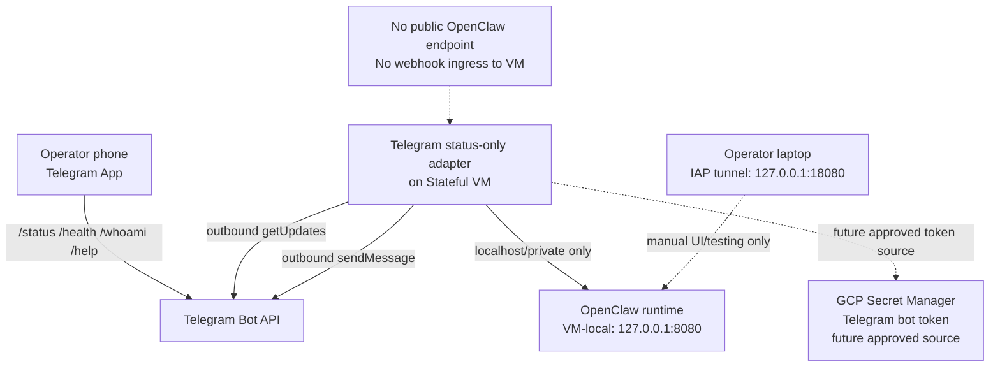
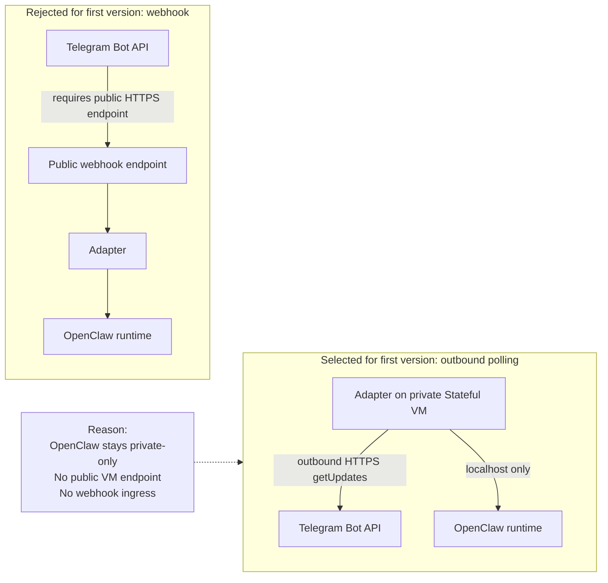

# OpenClaw Telegram Mobile Operator Channel

**Status:** Historical design; status-only runtime scope is now complete
**Scope:** Telegram status-only mobile operator channel for the OpenClaw
Stateful VM runtime

## Status Note

This document was created as the initial design for the Telegram mobile
operator channel. The approved status-only adapter is now live for the approved
scope and is closed out in
`telegram-status-only-adapter-runtime-closeout.md`.

Current approved commands: `/status`, `/health`, `/whoami`, and `/help`.
Out of scope without separate approval: `/ask`, GitHub commands, PR/write,
Terraform commands, shell execution, browser automation, MCP, DevBox execution,
and OpenClaw self-upgrade.

## Purpose

A mobile operator channel gives an approved operator a lightweight way to check
runtime status when desktop access, IAP tunnel access, or direct VM inspection is
not available. The first version should be status-only and must not become a
backdoor for expanding OpenClaw privileges.

This design follows the capability governance baseline:

```text
Agent may request new capabilities.
Agent may not grant itself new capabilities.
```

## Non-Goals

The initial Telegram/mobile channel does not allow:

* Terraform mutation;
* GitHub PR/write mode;
* Secret Manager payload reads;
* unrestricted shell access;
* OpenClaw self-upgrade;
* tool, skill, or MCP expansion through Telegram.

## Proposed Architecture

Recommended first architecture:

The adapter uses outbound polling so the Stateful VM does not need a public
inbound endpoint.



The adapter polls Telegram outbound from the Stateful VM. OpenClaw remains
private-only, and no public OpenClaw endpoint is exposed.

## Security Model

The first implementation must enforce these controls:

* store the Telegram bot token in Secret Manager;
* allow only explicitly approved Telegram chat IDs;
* keep OpenClaw private-only with no public gateway endpoint;
* never return secrets in Telegram responses;
* never write secrets, bot tokens, or sensitive message content to logs;
* do not execute shell commands directly from the adapter;
* do not bypass the OpenClaw tool policy;
* require a future approved change record for any mutating command.

The adapter should expose only fixed command handlers. It should not accept raw
operator text as a shell command, tool invocation, config patch, or Terraform
input.

## Initial Command Set

The first version is status-only:

* `/status` - high-level runtime and adapter status;
* `/health` - non-secret OpenClaw health result;
* `/whoami` - approved chat identity and effective channel permissions;
* `/help` - supported commands and current limitations.

## Later Expansion Gates

Each later capability requires a separate capability request, risk review,
operator approval, tracked config patch, validation, and rollback or disable
path:

* `/git-readonly-check`;
* `/ask`;
* PR/write mode;
* DevBox execution;
* browser automation;
* MCP.

Additional status-only commands require separate approval if they expose task
history, file paths, or operator messages.

## Implementation Options

The first proof of concept should prefer outbound polling over webhook ingress:



### Stateful VM Adapter With Outbound Polling

Runs a small Telegram adapter on the Stateful VM and polls the Telegram Bot API.
It can reach OpenClaw over localhost or private VM access and does not require a
public OpenClaw endpoint.

Port model:

* if the adapter runs on the Stateful VM, it should reach OpenClaw through the
  VM-local endpoint on port `8080`;
* if tests are run from an operator laptop through IAP, the local tunnel endpoint
  may be `127.0.0.1:18080`.

Benefits:

* preserves the private-only OpenClaw posture;
* avoids public webhook ingress;
* keeps the first proof of concept simple;
* fits the current Stateful VM runtime boundary.

Risks:

* adapter availability depends on the Stateful VM;
* outbound egress to Telegram must be allowed;
* bot token handling and chat allowlisting must be validated carefully.

### Cloud Run Webhook Adapter

Runs a separate Cloud Run service that receives Telegram webhooks and forwards
approved status checks to OpenClaw over a private path.

Benefits:

* webhook delivery can be responsive;
* adapter lifecycle is separate from the Stateful VM.

Risks:

* introduces public webhook ingress;
* requires additional IAM, networking, and deployment design;
* increases the first proof-of-concept surface area.

Recommendation: use the Stateful VM adapter with outbound polling for the first
proof of concept.

## Minimal Validation Plan

Before enabling the channel, validate that:

* bot token is stored in Secret Manager and not committed;
* only approved chat IDs can interact with the adapter;
* unknown users are rejected with a non-sensitive response;
* `/health` returns non-secret status only;
* logs do not expose the bot token, Secret Manager payloads, or sensitive
  message content;
* the adapter does not execute shell directly;
* the adapter does not bypass OpenClaw tool policy;
* OpenClaw remains private-only with no public endpoint.

## Disable And Rollback Path

The channel must have a simple disable path before it is enabled:

* stop or disable the adapter service;
* remove or rotate the Telegram bot token if exposed;
* remove the Telegram chat ID allowlist entry;
* confirm OpenClaw remains reachable only through the approved private paths;
* preserve validation evidence without storing secrets.
