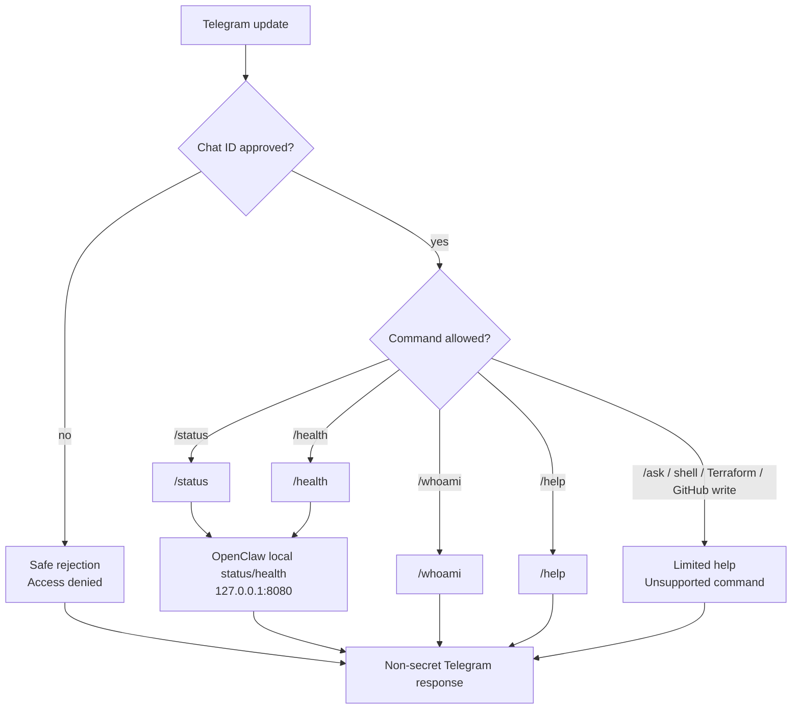

# Telegram Status-Only Adapter Enablement Approval Package

**Status:** Approval package; no enablement granted by this document
**Scope:** Future Telegram status-only adapter on the OpenClaw Stateful VM

## Status Note

This document is retained as the historical approval package for the
status-only Telegram rollout. The approved runtime scope is now complete and
closed out in
`gcp/openclaw_stateful_vm/docs/telegram-status-only-adapter-runtime-closeout.md`.

Current approved commands: `/status`, `/health`, `/whoami`, and `/help`.
Out of scope without separate approval: `/ask`, GitHub commands, PR/write,
Terraform commands, shell execution, browser automation, MCP, DevBox execution,
and OpenClaw self-upgrade.

Operator setup guide:
`gcp/openclaw_stateful_vm/docs/telegram-status-only-adapter-operator-setup.md`

Operator bootstrap steps for creating the Telegram bot, collecting the chat ID,
and storing the token in Secret Manager are documented in:
`gcp/openclaw_stateful_vm/docs/telegram-status-only-adapter-operator-bootstrap.md`

Enabled rollout approval package for the first real enablement:
`gcp/openclaw_stateful_vm/docs/telegram-enabled-rollout-approval-package.md`

Runtime closeout after approved status-only rollout:
`gcp/openclaw_stateful_vm/docs/telegram-status-only-adapter-runtime-closeout.md`

## Original Non-Enabled State

At the time of this approval package, the repository contained a local-only
Telegram adapter scaffold:

* fixed status-only command handlers;
* non-secret adapter config and approved chat ID parsing;
* loopback-only OpenClaw status snapshot provider;
* fake transport dispatcher for Telegram-like update dictionaries;
* dry-run CLI for local JSON fixtures;
* prepared runner wiring for future explicit runtime execution;
* prepared disabled systemd service template;
* default-disabled Terraform/bootstrap wiring for future approved rollout;
* unit tests for command routing, allowlist behavior, malformed input, and
  non-secret responses.

At that time, it had no committed Telegram token value, no committed real chat
ID, no running polling, no installed systemd unit, no Terraform apply, and no
runtime rollout.

## Proposed Enablement Scope

Future enablement may include only:

* Telegram Bot API outbound polling;
* status-only command responses;
* approved chat ID allowlist;
* bot token from approved secret source;
* adapter running on the Stateful VM;
* OpenClaw access through VM-local endpoint `http://127.0.0.1:8080`.

## Approved Initial Commands

Approved initial commands:

* `/status`
* `/health`
* `/whoami`
* `/help`

Out of scope: `/ask`, GitHub commands, Terraform commands, shell commands,
PR/write mode, DevBox execution, browser automation, MCP, and tool/skill
expansion.

Telegram messages pass through the adapter allowlist and fixed command router
before any local OpenClaw status check is attempted.



## Port Model

* VM-local OpenClaw runtime port: `8080`
* Operator laptop IAP tunnel port: `18080`
* Telegram adapter default OpenClaw endpoint on VM: `http://127.0.0.1:8080`
* Operator laptop tunnel URL for manual UI/testing only:
  `http://127.0.0.1:18080`

## Secret And Config Plan

Planned environment/config names:

```text
TELEGRAM_ALLOWED_CHAT_IDS
TELEGRAM_BOT_TOKEN_FILE
OPENCLAW_BASE_URL
```

Tracked secret mapping prepared for a future approved rollout:

```text
Terraform variable: telegram_bot_token_secret_id = openclaw-telegram-bot-token
Runtime file path: /run/openclaw/secrets/TELEGRAM_BOT_TOKEN
```

No token value may be committed. No token value may be printed in logs or
evidence. Secret Manager payload reads must be narrowly scoped to the Telegram
bot token only. Arbitrary Secret Manager reads remain out of scope. The
Telegram token secret identifier is tracked separately and is merged into
runtime secret retrieval only when `telegram_adapter_enabled = true`.

## Runtime Boundary

Future enablement must not change:

* GitHub mode remains readonly;
* PR/write remains disabled;
* MCP servers remain empty;
* OpenClaw remains private-only;
* no public OpenClaw endpoint;
* no Terraform mutation through Telegram;
* no shell execution through Telegram;
* no OpenClaw self-upgrade path.

## Critical Validation Checklist

Before enablement is accepted:

* final operator approval and an approved change record are present;
* adapter starts only after explicit approval;
* bot token is not in the repository;
* only approved chat IDs get responses;
* unknown chat IDs get safe rejection;
* `/status`, `/health`, `/whoami`, and `/help` return non-secret responses;
* logs do not contain token, Secret Manager payload, raw message text, or raw
  unknown chat IDs;
* OpenClaw health/readiness still pass locally on the VM;
* OpenClaw remains private-only;
* adapter disable stops Telegram access.

## Disable And Rollback

Rollback path:

* stop/disable adapter service;
* remove allowed chat IDs;
* rotate Telegram bot token if exposure is suspected;
* confirm OpenClaw still private-only;
* revert tracked adapter enablement patch if needed.

## Prepared Patch Boundary

The tracked runner and service template are enablement preparation only. They
must not be installed, enabled, or started until the final operator approval
gate, Terraform/runtime rollout plan, validation window, and rollback path are
approved. The Telegram token value remains only in Secret Manager and the
runtime token file path remains `/run/openclaw/secrets/TELEGRAM_BOT_TOKEN`.

Terraform/bootstrap support is prepared with `telegram_adapter_enabled = false`
as the default. No Terraform apply or runtime rollout has happened in this
repository state, no real Telegram chat ID is committed, and the default-disabled
rollout does not expose `/run/openclaw/secrets/TELEGRAM_BOT_TOKEN`.

## Approval Record

```text
Capability request approved:
Approved command set:
Approved architecture:
Approved chat ID allowlist owner:
Approved token storage approach:
Approved validation window:
Approved rollback owner:
Final approval status:
```
